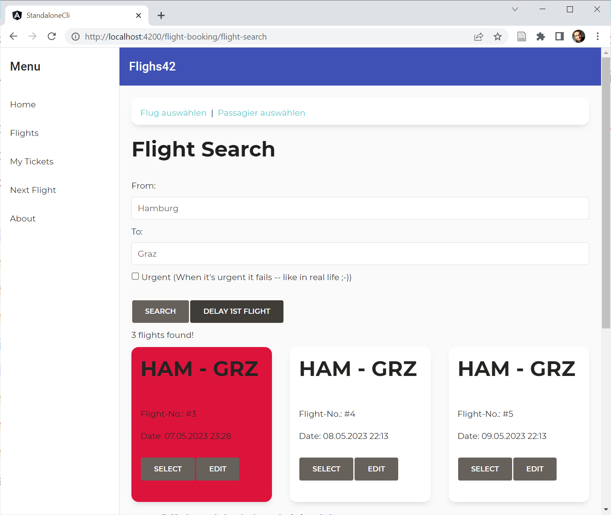

# Experiment 3: Nested Signals with the SolidJS Store

## Experiments

- [Experiment 1: Hidden Signals and Mutables](https://github.com/manfredsteyer/standalone-example-cli/tree/proxy)
- [Experiment 2: Explicit Signals and Mutables](https://github.com/manfredsteyer/standalone-example-cli/tree/nest)
- Experiment 3: Nested Angular Signals with the SolidJS Store (this one)

## What's this experiment about?

✅ This example uses a forked version of SolidJS store adopted for Angular Signals

✅ Get signal-based fine-grained change detection

✅ Just declare your state with the ``createSolidStore`` function:

```typescript
store = createSolidStore({
    flights: [] as Flight[],
    from: 'Hamburg',
    to: 'Graz',
    basket: { 1: true } as Record<number, boolean>,
    urgent: false,
});
```

The function ``createSolidStore`` is just a wrapper for the SolidJS store returning its getter and setter via a simple data structure with a ``state`` property (getter) and a ``set`` property (setter, equivalent to ``setState``). 

When accessing the store, we get a proxy wrapping an Angular Signal:

```typescript
const flights = store.state.flights;
```

Updating the store:

```typescript
store.set('flights', flights);
```

## How to try it out?

The application uses a trick to visualize the change detection. Each updated flight blinks red:



1. Start the Angular app
2. Click the ``flights`` menu item on the left 
3. Search for flights
4. All flights blink because they need to be data bound
5. Click "Delay 1st flight"
6. Only the 1st flight blinks


## How does it work?

✅ ``store.state.xyz`` returns a proxy

✅ This proxy creates signals for its properties on demand


## How is this different from other approaches?

✅ This is an experiment for lightweight management of (nested) signals.


## Credits

✅ Thanks to [Ryan Carniato](https://twitter.com/RyanCarniato), who is not only a great community member but also the principal author of SolidJS and mastermind for Signals.

